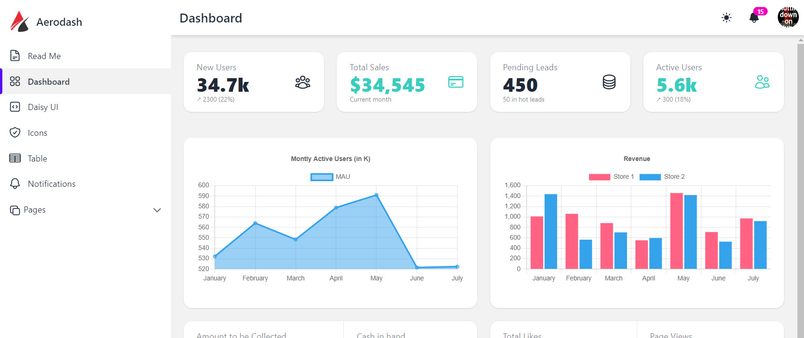

## Daisy UI Admin Dashboard Template - Aerodash

A free admin dashboard template using **Daisy UI** and react js. With the help of Daisy UI, it comes with **fully customizable and themable CSS** and power of Tailwind CSS utility classes. It also comes with **redux toolkit** configured.



## Demo

[Aerodash Live preview](https://github.com/facebook/create-react-app).


## Features

- **Light/dark** mode toggle
- Token based user authentication
- **Submenu support** in sidebar
- Store management using **redux toolkit**
- **Daisy UI** components
- **Right and left sidebar**, Universal loader, notifications and other components
- React **chart js 2** examples
- 
## Installation

Go to project directory and run

```bash
  npm install
  npm start
```

## Libraries Used

- [React JS v18.2.0](https://reactjs.org/)
- [React Router v6.4.3](https://reactrouter.com/en/main)
- [Tailwind CSS v3.2.4](https://tailwindcss.com/)
- [Daisy UI v2.41.0](https://daisyui.com/)
- [HeroIcons](https://heroicons.com/)
- [Redux toolkit v1.9](https://redux-toolkit.js.org/)
- [React ChartJS 2 v5](https://react-chartjs-2.js.org/)

## Documentation

[Documentation](https://linktodocumentation)

## License

[MIT](https://choosealicense.com/licenses/mit/)

## Feedback

If you have any feedback, please reach out to me
